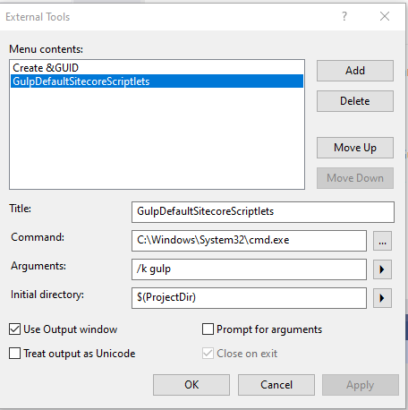
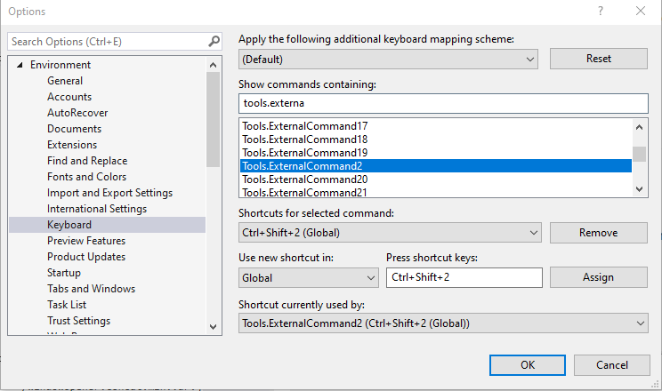

# Hind&bull;Site

## Folders
/AutoBuild - These are the working folders used by the build scripts. They are automatically cleaned and populated.
/src - Source code
/gulp.support - gulp support files used during the build process
/dist/HindSite - distributable files for extension installation

## How Logging Works
Logging automatically happens and is written to a buffer
- ___ switch
  - Off - it won't try to log anymore
  - On - Will cycle through all attached writers and output to them as each log line arrives.

- Flush - Will dump and remove the contents of the logging buffer to the currently attached writers.

## Managers
- contentMessageMan - Manages messages recieved from popup and returns responses to popup.
  - It reacts to those messages by triggering an API command.
  - It owns the Message Broker Agent
- Content Message Broker - Routes commands received by the MessageManager to the ApiManager
  - It owns the APIManager

## Logical Code Structure
* Almost all classes have iLoggerAgent

+ Low Level Agents
  + SettingsAgent
  + RepoAgent
  + 

+ Content
  + SiteCoreWindowManager
    + Desktop Manager
      + DesktopUiManager
      + ContentEditorManager
    + Content Editor Manager
      + ContentEditorUiManager

+ PopUp

## Environment Setup

-------------
I use a VS hotkey (ctrl+shift+2) assigned to an external tool in order to quickly run the build.

1. In VS, Go to tools/External tools and populate as shown below.
   a. GulpDefaultSitecoreScriptlets
   2. C:\Windows\System32\cmd.exe
   3. /k gulp
   4. $(ProjectDir)

You can now assign a VS hotkey to trigger that external tool

-------------
Consider installing the Extensions Reloader for Chrome https://chrome.google.com/webstore/detail/extensions-reloader/fimgfedafeadlieiabdeeaodndnlbhid?hl=en

  -------------

  Clone the Github repo

  -------------
  1. npm init
  2. it may take a while. Watch the bottom left of visual studio. It will say 'Installing packages'
  3. npm link gulp (I've forgotton what this does)
  4. npm i

  -------------

note: typescript compiling has been turned off in csproj

  -------------

## Contributing

1. Fork it!
2. Create your feature branch: `git checkout -b my-new-feature`
3. Commit your changes: `git commit -am 'Add some feature'`
4. Push to the branch: `git push origin my-new-feature`
5. Submit a pull request

## Standards and Conventions
1. Use a single space between methods.

## Known Issues

If intellisense stops working on browser.tabs.Tab, simply restart visual studio

## Not Implemented Yet (not prioritized)

1. auto purge
2. multi select  
3. add nickname to CE as tokens   
    lvl2 e.g. C: for content, L for Layout  
    Item name  
    Display name  
4. floating windows do not restore yet (e.g. when clicking on an items template)
5. Auto make a snap shot when restoring
6. Settings
   1. Show debug
   2. Customizable username and password (is password a good idea?)
   3. Selectable Sitecore buttons...kind of like the 'MyToolbar'
7. Detect if on login page when targeting desktop and such
8. Remember and set currently select node
9. search for node if not found
10. side by side (iframes) display
11. tree: preview
12. breakpoints  
     desktop, tablet, mobile, customizable
13. Extension integration chrome and ff
14. replace CM menu with customizable one
15. auto click irritating buttons such as during publish
16. Close Hind&bull;Site child window when no longer associated with the current browser tab
17. Hotkeys
18. Clear Existing tabs?
19. Icons
20. Hover states for CE tab buttons to show which path is current?
21. Open preview/edit/normal window when on node
22. Go to x indexed favorite
23. Open node in new content editor iframe
24. Go to node's template

  

    

