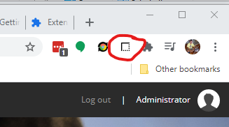

# Hind&bull;Site

## Usage

Once installed, you should find an icon in your browser.
In Chrome it looks like: 

**Normal Click** - Opens in new tab  
**Ctrl Click** - Opens in current tab  
**Nickname** - for human readable snapshot name, click 'Set Nickname' to change  
**Save Window State** - Saves the nodes of the current tab  
**Restore State** - Restores  
    1. If you restore a desktop state to a CE, it will just restore the first on in CE  
    2. If you restore either a desktop or CE to a desktop state, it will just add new CE's to the existing desktop

